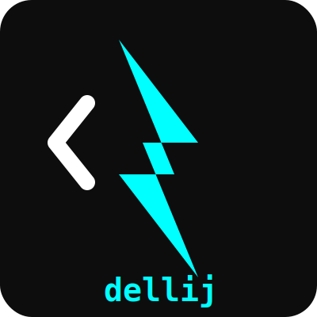
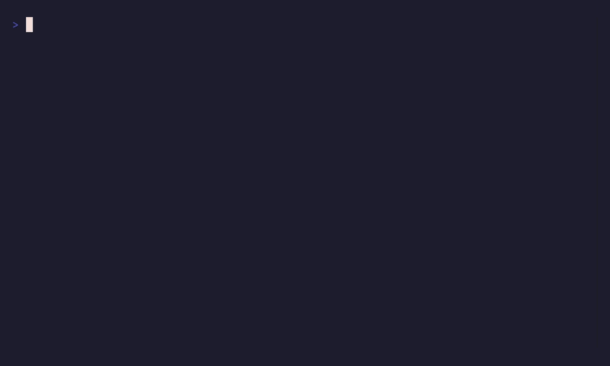

# dellij ⚡

<p align="center">
  
</p>

**dellij** is a modern terminal workspace manager built exclusively for **Zellij**.
It allows you to manage parallel development workflows using AI coding agents, leveraging native Zellij features like WASM plugins and KDL layouts.

[https://github.com/Diogenesoftoronto/dellij](https://github.com/Diogenesoftoronto/dellij)

Inspired by [dmux](https://github.com/formkit/dmux), but re-imagined for the next generation of terminal multiplexers.


## Key Features

- 🤖 **Multi-Agent Orchestration**: Launch multiple AI agents (Claude, Gemini, Aider, etc.) in parallel.
- 🧩 **Native WASM Plugin**: Real-time agent status tracking directly in your Zellij UI bar with zero polling overhead.
- 📐 **Contextual Agent Workspace**: Every agent starts in a custom **KDL layout** with a dedicated agent pane, a scratch shell, and a live git status widget.
- 🪝 **Priority Hooks**: Extensive hook system with support for team, local, and global lifecycle scripts.
- 🛡️ **Robust Execution**: Built-in retry strategies with exponential backoff for multiplexer commands.

## Demos

### 1. Multi-Agent Launch
Launch agents into dedicated Zellij tabs with pre-configured multi-pane layouts.


### 2. Custom Lifecycle Hooks
Automate your workflow by running scripts when worktrees are created, merged, or closed.


### 3. Worktree & Merge Workflow
Seamlessly manage git worktrees and merge them back to your base branch directly from the TUI.


## Getting Started

### Installation

1. Ensure you have [Zellij](https://zellij.dev/) installed.
2. Clone this repository and install dependencies:
   ```bash
   cd dellij
   bun install
   ```
3. Build the plugin:
   ```bash
   cd plugin
   ./build.sh
   ```

### Usage

Run `dellij` from your project root:
```bash
bun run src/index.ts
```

### Development Tasks

This project uses [mise](https://mise.jdx.sh/) to manage development tasks:

- `mise run build:plugin`: Build the Rust WASM plugin.
- `mise run dev`: Start dellij in development mode.
- `mise run ui`: Start the TUI in isolation for testing.
- `mise run typecheck`: Run TypeScript type checking.
- `mise run record`: Update all demo GIFs using VHS.
- `mise run release`: Build and typecheck everything.

## Hook System

`dellij` looks for executable scripts in the following order of priority:

1. `.dellij-hooks/` - Team hooks (version controlled)
2. `.dellij/hooks/` - Local overrides
3. `~/.dellij/hooks/` - Global user hooks

**Available hooks:** `before_pane_create`, `pane_created`, `worktree_created`, `before_pane_close`, `pane_closed`, `pre_merge`, `post_merge`, `run_test`, `run_dev`.

## Comparisons with dmux

| Feature | dellij (Zellij) | dmux (Tmux) |
| :--- | :--- | :--- |
| **Syncing** | Native Event-Driven (WASM) | Polling / SIGUSR2 |
| **Layouts** | KDL Declarative Panes | Command-based splitting |
| **Plugins** | Integrated Rust WASM Plugin | External TUI process |
| **Robustness** | Exponential Backoff Retries | Basic Retries |

## License

MIT
